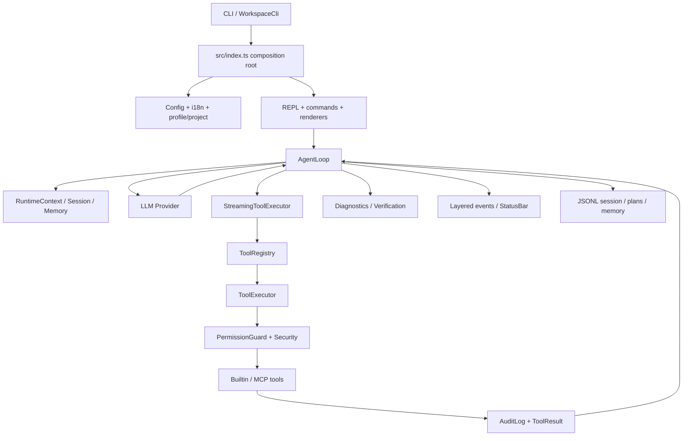

# RoxyCode 完整项目学习手册

> 适用版本：RoxyCode v0.1.0（2026-07）
> 适用对象：没有系统学过 TypeScript，但需要快速理解项目、独立修改代码并应对面试追问的开发者。
> 源码目录：`D:\Programing\RoxyCode`
> Claude Code 对照源码：`D:\Programing\cc\claude-code-main`

## 1. 学习目标

这份手册不要求背完所有文件。最终目标是达到下面六级标准：

```text
能运行 -> 能定位 -> 能解释 -> 能修改 -> 能排错 -> 能比较取舍
```

完成后，你应该能够：

1. 不依赖 AI，从零安装、配置、启动并演示 RoxyCode。
2. 画出一次用户请求从终端输入到模型、工具、权限、验证和会话落盘的完整链路。
3. 解释 Agent 与普通聊天接口的本质区别。
4. 独立新增一个命令、一个工具或一个 Provider，并补充测试。
5. 排查 API、工具权限、文件编辑、上下文、Memory 和 LSP 常见故障。
6. 说明 RoxyCode 借鉴了 Claude Code 的哪些设计，以及为什么没有直接复制其实现。
7. 证明角色系统会影响提示词、解释方式、风险偏好和工作流，而不只是终端换肤。

## 2. 项目定位与边界

RoxyCode 是一个二次元可定制、中文优先、多模型兼容的 CLI 编程 Agent。它的产品目标可以拆成两层：

- 工程底座：模型流式输出、工具调用、权限守卫、真实工作区编辑、会话、上下文压缩、Memory、Plan、LSP、多 Agent 和扩展生态。
- 差异化体验：中文交互、国产模型兼容、教学型解释、角色人格、角色包、审美模式和可定制工作流。

必须诚实区分“当前已经实现”和“长期目标”：

- 当前是可运行的工程原型，已经形成模型与工具闭环，并有系统化测试。
- 它还没有达到 Claude Code 在终端渲染、超长会话稳定性、权限规则覆盖、平台兼容和生产用户规模上的成熟度。
- `Ultimate`、MCP 远程传输、插件沙箱和多语言 LSP 已有基础，但仍需要真实复杂项目验证。
- 角色系统是核心产品方向，但角色对 Agent 策略的影响必须始终低于安全规则和事实验证。

面试中不要说“完全复刻 Claude Code”。更准确的表达是：

> 我参考 Claude Code 已验证的 Agent 工程边界，实现了一个可运行的 TypeScript CLI 编程 Agent，并围绕中文开发者、教学体验和角色深度定制做了产品化扩展。

## 3. 五分钟跑通项目

### 3.1 环境要求

- Node.js 20 或更高版本
- pnpm 11
- Git
- 一个 OpenAI-compatible 或已支持 Provider 的 API
- 可选：`typescript-language-server`、Vue/Java 语言服务器

### 3.2 安装和质量检查

```powershell
cd D:\Programing\RoxyCode
pnpm install
pnpm check
```

`pnpm check` 顺序执行：

```text
TypeScript 类型检查
  -> 源码入口可达性检查
  -> tsup 生产构建
  -> Node Test Runner 测试
```

四个步骤解决不同问题：

- `typecheck`：接口、联合类型、空值和调用参数是否正确。
- `check:dead-code`：源码是否能从生产入口触达，防止保留失效的重复架构。
- `build`：ESM 打包和运行时依赖是否正确。
- `test`：行为是否符合契约。

### 3.3 全局安装和跨目录启动

```powershell
pnpm install:global
roxycode --version
roxycode D:\Projects\my-app
```

也可以在目标项目终端中执行：

```powershell
roxycode .
```

入口参数由 `src/cli/WorkspaceCli.ts` 解析，`src/index.ts` 在创建配置、工具和会话前调用 `process.chdir(workspace)`。因此工作区边界、`.roxycode` 数据和文件工具都以目标项目为根，而不是以 RoxyCode 源码目录为根。

### 3.4 API 安全配置

推荐使用环境变量或不会提交的 `.roxycode/config.local.json`：

```powershell
$env:ROXY_LLM_PROVIDER="compatible"
$env:ROXY_OPENAI_API_KEY="sk-..."
$env:ROXY_OPENAI_BASE_URL="https://provider.example.com/v1"
$env:ROXY_LLM_MODEL="provider-supported-model"
roxycode D:\Projects\my-app
```

配置优先级从低到高：

```text
default -> global -> project -> local -> env -> session
```

对应位置：

- 全局：`~/.roxycode/config.json`
- 项目共享：`<workspace>/.roxycode/config.json`
- 本机私有：`<workspace>/.roxycode/config.local.json`
- 环境变量：当前进程
- session：当前运行期临时覆盖

排错命令：

```text
/config validate
/config sources
/status
/diagnostics
```

不要把真实密钥写入 README、ROXY.md、测试、会话示例或 Git 历史。

## 4. TypeScript 最小前置知识

不要先学完整本 TypeScript 教程。先用项目中的真实文件掌握六组概念。

### 4.1 interface、type 和联合类型

阅读：

- `src/core/types/message.ts`
- `src/tool/types.ts`
- `src/engine/agent/types.ts`
- `src/aesthetic/character/types.ts`

理解重点：

```ts
type AgentLoopMode = 'lite' | 'economic' | 'standard' | 'ultimate'

interface ToolResult {
  success: boolean
  output: string
  error?: string
}
```

- `interface` 常用于可扩展对象契约。
- `type` 适合联合类型、映射类型和别名组合。
- `?` 表示字段可能不存在，使用前必须判断。
- 字符串字面量联合让编译器阻止无效模式。

练习：给 `AgentLoopEvent` 增加一种只携带耗时的事件，观察所有 `switch` 和渲染器需要如何修改。

### 4.2 泛型

阅读：

- `src/tool/builder/ToolBuilder.ts`
- `src/core/configSchema.ts`
- `src/mcp/transports/Transport.ts`

泛型不是“高级语法装饰”，而是把输入类型和输出类型建立关系。例如一个工具构建器必须保证 schema、执行参数和结果属于同一套类型契约。

练习：实现一个 `Result<T>`，分别包装配置读取结果和工具执行结果，比较它与直接 `throw Error` 的取舍。

### 4.3 Promise 与 async/await

阅读：

- `src/index.ts`
- `src/core/ConfigManager.ts`
- `src/session/store/SessionStore.ts`

必须能回答：

- `await` 为什么不会阻塞整个 Node.js 进程？
- `Promise.all` 什么时候适合并行，什么时候会造成写冲突？
- 为什么文件写入和审计日志需要关注顺序？
- `try/catch` 能捕获哪些异步错误？

练习：把两个互不依赖的只读初始化任务并行化，并用计时证明收益；不要并行化存在先后依赖的配置覆盖。

### 4.4 async function*、yield 和 for await

阅读：

- `src/engine/agent/AgentLoop.ts`
- `src/engine/agent/StreamingToolExecutor.ts`
- `src/tool/builtin/readFile.ts`
- `src/tool/builtin/executeCommand.ts`

异步生成器适合“结果尚未完成，但需要持续产生事件”的场景：

```ts
async function* runTask() {
  yield { type: 'progress', text: 'starting' }
  const result = await doWork()
  yield { type: 'result', result }
}

for await (const event of runTask()) {
  render(event)
}
```

RoxyCode 用它统一模型流、工具进度和最终结果。它比“最后一次性返回字符串”更适合 CLI Agent。

练习：给 `read_file` 增加“已读取字节数”进度，确认 UI 能收到事件且最终 ToolResult 不变。

### 4.5 Node.js 的 fs、path 和 process

阅读：

- `src/cli/WorkspaceCli.ts`
- `src/tool/security/FileMutationGuard.ts`
- `src/session/store/SessionStore.ts`
- `src/aesthetic/character/custom/CharacterPackageManager.ts`

必须掌握：

- `resolve`、`join`、`relative`、`dirname` 的区别。
- 为什么用户输入路径必须先规范化再检查工作区边界。
- `process.cwd()` 与源码文件目录不是同一概念。
- `fs/promises` 为什么比回调 API 更适合当前结构。
- Windows 盘符、大小写、反斜杠和路径逃逸有什么风险。

练习：为路径守卫补充 `..`、绝对路径、相似前缀目录和符号链接测试。

### 4.6 Zod 的 parse 与 safeParse

阅读：

- `src/aesthetic/character/CharacterSchema.ts`
- `src/core/configSchema.ts`
- `src/mcp/types.ts`

区别：

- `parse`：失败时抛异常，适合调用方必须立即终止。
- `safeParse`：返回成功或失败联合类型，适合收集多个错误并给用户结构化提示。

练习：向角色 manifest 写入非法 SemVer、路径逃逸和错误颜色值，跟踪 Zod issue 如何被 Validator 转成中文错误列表。

## 5. 总体架构

### 5.1 分层图



### 5.2 目录责任

| 目录 | 责任 | 不应该承担的责任 |
|---|---|---|
| `src/cli` | 启动参数和工作区解析 | Agent 业务逻辑 |
| `src/core` | 配置、错误、共享协议类型 | UI 渲染 |
| `src/ui` | 输入、命令面板、状态栏、事件显示 | 绕过权限直接执行工具 |
| `src/commands` | Slash 命令定义、解析、动态来源 | 模型协议实现 |
| `src/engine/agent` | 推理模式和 query/tool/result 循环 | 直接读写文件 |
| `src/engine/llm` | Provider 适配、流解析、重试 | 决定文件权限 |
| `src/tool` | 工具定义、执行、安全、审计 | 角色人格 |
| `src/session` | 会话、计划、上下文、Memory | 终端输入处理 |
| `src/aesthetic` | 角色、主题和角色包 | 覆盖安全策略 |
| `src/workflow` | YAML 过程化任务 | 任意动态代码执行 |
| `src/mcp` | 外部工具协议和传输 | 默认信任远程服务 |
| `src/hooks` / `src/plugin` | 扩展加载和沙箱边界 | 绕过统一工具链 |
| `src/lsp` | 代码诊断反馈 | 替代测试和构建 |
| `src/engine/multi-agent` / `src/worktree` | 并行协调和隔离 | 静默覆盖冲突 |
| `src/runtime` / `src/telemetry` | 运行态快照、性能和事件记录 | 保存密钥和提示词全文 |

## 6. 一次真实请求的完整调用链

以“帮我给当前项目增加一个 TypeScript 功能并运行测试”为例：

1. `src/index.ts` 解析工作区，加载配置、语言、角色、Provider 和 ContextManager。
2. `REPL.start()` 初始化 Session、Memory、工具、命令、Hooks、Plugins 和 MCP。
3. 输入由 `RawLineReader`/fallback stdin 交给 `REPL.onLineSubmit()`。
4. `/` 开头进入 `CommandParser -> CommandRegistry`；普通文本进入 Agent 请求。
5. REPL 写入用户消息 JSONL，并组装角色、项目画像、ROXY.md、Memory 和运行态上下文。
6. `AgentLoop.run()` 根据模式选择能力：Lite 单轮、Economic 工具循环、Standard 计划执行验证、Ultimate 多 Agent。
7. Provider 把统一 `Message[]` 转成 OpenAI-compatible 请求，并流式解析文本和 tool calls。
8. Agent 收到 tool call 后交给 `StreamingToolExecutor`，参数流会产生“正在接收参数”等事件。
9. `ToolRegistry` 根据工具名找定义，`ToolExecutor` 执行 schema 校验、权限判断、安全检查、备份和审计。
10. 文件工具只能在允许工作区内操作；已有文件写入前要求 read-before-write，并检查文件是否在读取后被外部修改。
11. 工具进度实时发送给 UI，最终结果被 `ToolResultSummarizer` 压缩后回传模型。
12. 模型继续请求工具或输出答案，直到达到停止条件、轮数上限、取消或错误。
13. 修改 TypeScript 文件后，验证阶段调用 `CodeDiagnostics`；诊断错误可注入下一轮修复。
14. Standard 模式执行验证提示，形成“分析 -> 计划 -> 执行 -> 验证 -> 总结”。
15. REPL 更新 Todo、RuntimeState、Telemetry、Session 和自动 Memory 待审核队列。

必须画得出的协议顺序：

```text
user message
  -> assistant text/tool_use
  -> tool executor
  -> tool_result with matching toolCallId
  -> assistant continuation
  -> verification
  -> final answer
```

`tool_use` 和 `tool_result` ID 必须配对。`src/engine/llm/ToolResultPairing.ts` 会修复部分缺失、重复和孤立结果，避免兼容网关直接拒绝请求。

## 7. 核心模块精读

每一节都按“源码 -> 问题 -> 练习 -> 验收”完成。

### 7.1 CLI、REPL 与交互渲染

必读源码：

- `src/index.ts`
- `src/cli/WorkspaceCli.ts`
- `src/ui/repl/REPL.ts`
- `src/ui/repl/RawLineReader.ts`
- `src/ui/renderers/InteractionRenderer.ts`
- `src/ui/renderers/ToolActivityRenderer.ts`
- `src/ui/renderers/StatusBar.ts`

必须回答：

- 为什么 `src/index.ts` 应当只做依赖组装，而不是放全部业务逻辑？
- 交互式 TTY 和管道输入为什么需要两条输入路径？
- 为什么 UI 消费结构化 `AgentLoopEvent`，而不是解析模型字符串？
- 工作区为什么必须在创建 ConfigManager 和工具运行时之前确定？

练习：新增 `--no-splash` 参数，补 CLI 单元测试和构建后 smoke test。

验收：从任意目录启动指定工作区，能解释每个启动对象的创建顺序。

### 7.2 配置、国际化、个人画像和项目画像

必读源码：

- `src/core/ConfigManager.ts`
- `src/core/configSchema.ts`
- `src/core/types/config.ts`
- `src/i18n/index.ts`
- `src/profile/ProfileManager.ts`
- `src/project/ProjectInitializer.ts`
- `src/session/project/RoxyManifest.ts`

必须回答：

- 配置分层为什么不能只做一次浅拷贝？
- API Key 为什么必须脱敏，为什么测试要注入临时 home？
- `profile.json`、`project.json` 和 `ROXY.md` 分别保存什么？
- 用户偏好与团队项目规则为什么要分开？

练习：增加一个布尔配置项，走完类型、默认值、Zod、环境变量、`/config` 和测试。

验收：能根据 `/config sources` 定位某个值来自全局、项目、本机还是环境变量。

### 7.3 LLM Provider 与流式协议

必读源码：

- `src/engine/llm/BaseLLMProvider.ts`
- `src/engine/llm/LLMFactory.ts`
- `src/engine/llm/OpenAIProvider.ts`
- `src/engine/llm/QwenProvider.ts`
- `src/engine/llm/DeepSeekProvider.ts`
- `src/engine/llm/GLMProvider.ts`
- `src/engine/llm/ToolResultPairing.ts`
- `src/core/types/message.ts`

必须回答：

- OpenAI-compatible 是协议兼容，不代表模型一定是 OpenAI 模型。
- SSE 文本 delta 和 tool call arguments delta 如何累积？
- 401、404、429、5xx 和网络错误的重试策略为什么不同？
- Provider 为什么不能直接返回终端格式字符串？
- fallback model 在什么错误下才应该切换？

练习：使用本地 mock HTTP server 模拟 429 后成功、畸形 SSE、重复 tool call ID 和超时。

验收：不用看源码，能讲出一次流式请求从 `fetch` 到统一 `LLMResponse` 的转换过程。

### 7.4 Agent Loop 与四档模式

必读源码：

- `src/engine/agent/AgentLoop.ts`
- `src/engine/agent/modes.ts`
- `src/engine/agent/prompts.ts`
- `src/engine/agent/RuntimeContext.ts`
- `src/engine/agent/StreamingToolExecutor.ts`
- `src/engine/agent/TokenBudget.ts`
- `src/engine/agent/ToolResultSummarizer.ts`

模式边界：

| 模式 | 核心行为 | 工具 | 适合场景 |
|---|---|---|---|
| Lite | 单轮回答 | 通常不使用 | 简单解释 |
| Economic | ReAct 循环 | 支持 | 小修改、低成本 |
| Standard | 计划、执行、诊断、验证 | 支持 | 默认真实开发 |
| Ultimate | Coordinator 与子 Agent | 支持、隔离 | 可拆分复杂任务 |

必须回答：

- Agent Loop 的停止条件有哪些？
- 为什么计划输出后需要追加 user continuation 才兼容部分 Claude 网关？
- 工具结果为什么要摘要，但错误、路径和关键 diff 不能丢？
- 模型“想调用工具”和系统“允许执行工具”为什么是两件事？
- AbortSignal 如何从用户取消传到命令子进程？

练习：增加一个最大连续失败数限制，并补充恢复建议事件测试。

验收：能在白板上写出 Economic 与 Standard 的状态机差异。

### 7.5 工具、权限与工作区安全

必读源码：

- `src/tool/registry/ToolRegistry.ts`
- `src/tool/executor/ToolExecutor.ts`
- `src/tool/permission/PermissionGuard.ts`
- `src/tool/permission/PermissionClassifier.ts`
- `src/tool/security/FileMutationGuard.ts`
- `src/tool/security/FileReadState.ts`
- `src/tool/security/FileBackup.ts`
- `src/tool/security/ShellSafety.ts`
- `src/tool/audit/AuditLog.ts`
- `src/tool/builtin/*.ts`

统一链路：

```text
ToolRegistry
  -> parameter validation
  -> PermissionClassifier
  -> PermissionGuard
  -> file/shell safety
  -> optional confirmation
  -> backup
  -> builtin executor
  -> AuditLog
  -> ToolResult
```

必须回答：

- `isReadOnly`、`concurrencySafe`、`destructive` 分别影响什么？
- read-before-write 和 stale edit 检查解决什么竞态？
- 为什么“路径字符串以 cwd 开头”不是可靠的边界检查？
- 高危命令为什么需要二次确认？
- 工具失败后为什么仍要生成标准 ToolResult 回传模型？

练习：独立新增 `count_lines` 工具，要求支持 schema、流式进度、权限分类、审计和测试。

验收：能从一个 tool call 一直追踪到 `.roxycode/audit/tools.jsonl`。

### 7.6 会话、上下文、Plan、Todo 与 Memory

必读源码：

- `src/session/store/SessionStore.ts`
- `src/session/context/ContextManager.ts`
- `src/session/context/strategies/SummaryStrategy.ts`
- `src/session/plan/PlanStore.ts`
- `src/tool/builtin/todoWrite.ts`
- `src/session/memory/MemoryStore.ts`
- `src/session/memory/MemoryRetriever.ts`
- `src/session/memory/MemoryPolicy.ts`
- `src/session/memory/AutoMemoryExtractor.ts`
- `src/session/memory/MemoryPersona.ts`

区分四个概念：

- Session：本次对话的可恢复事件历史。
- Context：本轮实际发送给模型的有限消息集合。
- Plan/Todo：当前任务状态，不应自动当作长期记忆。
- Memory：跨会话仍有价值的稳定偏好、反馈和项目知识。

Memory 类型：`user`、`project`、`feedback`、`reference`、`learning`、`workflow`。

必须回答：

- JSONL 相比单个 JSON 数组的优势和缺点是什么？
- 截断与摘要压缩分别会丢失什么？
- TF-IDF top-5 如何计算，为什么暂时不直接上向量数据库？
- 自动 Memory 为什么先进入 pending review？
- 哪些内容属于敏感信息、临时状态或无价值噪声？

练习：手算三个文档的 TF-IDF 排序；再增加一条“本地绝对路径不能自动记忆”的策略测试。

验收：能解释 `/resume`、`/rewind`、`/compact`、`/memory review` 的数据变化。

### 7.7 角色系统和角色包

必读源码：

- `src/aesthetic/character/types.ts`
- `src/aesthetic/character/CharacterManager.ts`
- `src/aesthetic/character/CharacterPromptLoader.ts`
- `src/aesthetic/character/CharacterSchema.ts`
- `src/aesthetic/character/custom/CustomCharacterLoader.ts`
- `src/aesthetic/character/custom/CharacterPackageManager.ts`
- `src/aesthetic/character/custom/CharacterPackageValidator.ts`
- `src/aesthetic/character/custom/CharacterPackagePacker.ts`
- `docs/CHARACTER_PACKAGE_SPEC.md`

角色影响范围：

- 主题、启动画面、状态栏、台词和 companion。
- System prompt 人格和解释深度。
- 审查重点、风险表达和建议工作流。
- Memory 类型偏好。
- 角色包贡献的 prompt、workflow、hook 和 i18n。

角色不能影响：

- 工作区路径边界。
- 用户明确拒绝的权限。
- Shell 高危分类。
- schema、测试和 LSP 的事实结果。

必须回答：

- `manifest.json` 与 `character.json` 为什么拆开？
- `.roxychar` 为什么是 ZIP，但不能直接普通解压？
- Zip Slip、zip bomb、重复 entry、symlink 和超大文件如何防御？
- engines.roxycode 为什么要做 SemVer 兼容检查？
- 如何证明角色不是 UI 换皮？

练习：创建最小 teacher 角色包，完成 validate、pack、install、switch、export、uninstall。

验收：能解释从 `/character install` 到 CharacterManager 热刷新全过程。

### 7.8 命令、Workflow 与 Skill

必读源码：

- `src/commands/CommandParser.ts`
- `src/commands/CommandRegistry.ts`
- `src/commands/CommandLoader.ts`
- `src/commands/sources/*.ts`
- `src/workflow/WorkflowLoader.ts`
- `src/workflow/WorkflowRunner.ts`
- `src/workflow/WorkflowExecutor.ts`

必须回答：

- 内置命令、Workflow 命令、Plugin 命令和 Skill 命令如何聚合？
- 动态命令为什么不能覆盖保留的内置命令？
- Workflow 的变量、条件、循环、tool step 和 agent step 如何执行？
- 声明式 YAML 相比直接执行 JavaScript 插件有什么安全优势？
- 热重载为什么只适合开发模式？

练习：新增一个中文“定位并修复测试失败”工作流，包含条件、工具步骤和验证步骤。

验收：能从 `.roxycode/workflows/*.yml` 追踪到 `/wf:<id>` 注册和执行。

### 7.9 MCP、Hooks 与 Plugin

必读源码：

- `src/mcp/McpTransportFactory.ts`
- `src/mcp/transports/Transport.ts`
- `src/mcp/transports/JsonRpcMcpClient.ts`
- `src/mcp/McpToolAdapter.ts`
- `src/mcp/auth/OAuthFlow.ts`
- `src/hooks/HookLoader.ts`
- `src/hooks/HookManager.ts`
- `src/plugin/PluginLoader.ts`
- `src/plugin/PluginSandbox.ts`

必须回答：

- MCP 的 initialize、tools/list、tools/call 分别做什么？
- stdio、HTTP、SSE、streamable HTTP 和 WebSocket 的生命周期差异是什么？
- MCP tool annotation 如何映射为 read-only/destructive/concurrency 信息？
- command、prompt、http、agent hook 分别适合什么场景？
- 为什么“插件目录边界”不等于完整操作系统沙箱？
- OAuth PKCE 中 verifier、challenge 和 token store 的作用是什么？

练习：实现一个只读 mock MCP Server，暴露 `project_stats` 工具；再验证它仍走 PermissionGuard 和 AuditLog。

验收：能够指出当前插件沙箱的能力边界，不把它描述成绝对安全。

### 7.10 多 Agent 与 Git Worktree

必读源码：

- `src/engine/multi-agent/Coordinator.ts`
- `src/engine/multi-agent/TaskGraph.ts`
- `src/engine/multi-agent/TaskClaimStore.ts`
- `src/engine/multi-agent/FileLockManager.ts`
- `src/engine/multi-agent/MultiAgentRuntime.ts`
- `src/engine/multi-agent/ConflictMerger.ts`
- `src/worktree/WorktreeManager.ts`

必须回答：

- Coordinator 如何拆分依赖图？
- 原子 claim 防止什么重复执行？
- FileLock 和 Worktree 各自解决什么问题？
- 为什么 dirty worktree 默认保留而不是强删？
- 合并前冲突检测与直接 `git merge` 的风险差异是什么？
- 并行任务什么时候反而更慢？

练习：构造两个子 Agent 修改同一文件的冲突，证明主工作区不会静默丢代码。

验收：能用时序图解释 Ultimate 模式的创建、认领、执行、验证、合并和清理。

### 7.11 LSP、运行态与可观测性

必读源码：

- `src/lsp/LSPClient.ts`
- `src/lsp/CodeDiagnostics.ts`
- `src/runtime/RuntimeState.ts`
- `src/runtime/QueryProfiler.ts`
- `src/telemetry/TelemetryLogger.ts`
- `src/commands/builtin/diagnostics.ts`

必须回答：

- LSP initialize、initialized、didOpen 和 publishDiagnostics 的顺序是什么？
- TypeScript compiler fallback 与 language server 有什么差别？
- 为什么 monorepo 要寻找最近的 tsconfig？
- LSP 通过是否等于功能正确？
- RuntimeState、Telemetry 和 AuditLog 分别记录什么？
- 如何避免可观测性数据泄露密钥和敏感源码？

练习：制造 TS 类型错误，让 `/diagnostics` 报出并修复；再为 Vue 项目设计 `vue-tsc` 接入方案。

验收：最终总结能区分“验证通过”“仍有诊断”“未能执行验证”。

## 8. 数据落盘地图

| 路径 | 内容 | 是否建议提交 Git |
|---|---|---|
| `~/.roxycode/config.json` | 用户全局配置 | 否 |
| `~/.roxycode/memory.jsonl` | 用户级长期 Memory | 否 |
| `~/.roxycode/MEMORY.md` | 用户 Memory 索引 | 否 |
| `.roxycode/config.json` | 项目共享配置 | 视团队约定 |
| `.roxycode/config.local.json` | 本机配置和密钥 | 否 |
| `.roxycode/profile.json` | 用户偏好画像 | 通常否 |
| `.roxycode/project.json` | 结构化项目画像 | 可以 |
| `ROXY.md` | 项目级自然语言规则 | 可以 |
| `.roxycode/sessions/*.jsonl` | 会话事件 | 否 |
| `.roxycode/plans/*` | Plan 状态 | 通常否 |
| `.roxycode/memory.jsonl` | 项目长期 Memory | 视内容决定 |
| `.roxycode/memory.pending.json` | 待用户审核的自动 Memory | 否 |
| `.roxycode/audit/tools.jsonl` | 工具审计 | 否 |
| `.roxycode/telemetry/events.jsonl` | 本地运行遥测 | 否 |
| `.roxycode/worktrees/` | 多 Agent 隔离工作区 | 否 |

排错时先判断问题属于哪一层，再检查相应数据，避免“删除整个 `.roxycode` 重试”这种破坏性做法。

## 9. 与 Claude Code 的源码对照

本节基于本地 `D:\Programing\cc\claude-code-main`。Claude Code 版本会变化，学习的是边界和设计思想，不是复制私有实现。

| 能力 | Claude Code 对照位置 | RoxyCode 对照位置 | 当前取舍 |
|---|---|---|---|
| CLI 与 UI | `src/cli`、React/Ink components | `src/cli`、`src/ui/repl`、renderers | Roxy 更轻，中文定制直接；复杂布局和终端兼容不如 Ink 成熟 |
| 命令聚合 | `src/commands.ts` 和命令目录 | `CommandRegistry`、`CommandLoader` | Roxy 显式区分 Workflow/Plugin/Skill 来源 |
| Agent 循环 | query、tool_use、tool_result 流式路径 | `AgentLoop`、`StreamingToolExecutor` | 核心理念一致；Roxy 用四档模式显式产品化 |
| 工具契约 | 工具模块自带 schema、权限和执行逻辑 | `Tool` + Registry + Guard + Executor | Roxy 链路更适合学习；Claude Code 工具覆盖和平台适配更成熟 |
| 权限 | `src/hooks/toolPermission`、permissions utils/components | `src/tool/permission`、`src/tool/security` | 都强调不可绕过；Roxy 增加中文和角色化危险解释 |
| Plan Mode | Enter/ExitPlanMode tools 和状态 | `/plan`、`PlanStore`、TodoStore | Roxy 审批文本更显式；Claude Code 模式切换更深地集成运行态 |
| Settings | user/project/local/policy/flag settings | default/global/project/local/env/session | Roxy 兼顾国产 Provider；企业策略层仍弱于 Claude Code |
| 项目记忆 | `CLAUDE.md`、`src/context.ts`、memdir | `ROXY.md`、project.json、MemoryStore | Roxy 将结构化项目画像与自然语言指令分开 |
| 自动 Memory | `extractMemories`、memory commands | Extractor + Policy + pending review | Roxy 新增 learning/workflow，并要求用户审核 |
| MCP/Hooks/Plugin | 成熟扩展和设置体系 | `src/mcp`、`src/hooks`、`src/plugin` | Roxy 有协议骨架和沙箱边界，生态与隔离强度仍需提升 |
| Worktree | Enter/ExitWorktree 和稳定 project root | WorktreeManager + Ultimate runtime | Roxy 将子 Agent 分工作为可见产品状态 |
| 角色定制 | theme、buddy 等轻量体验 | Character、package、persona、workflow | Roxy 的核心差异化，但必须服从统一安全层 |

从 Claude Code 借鉴的五个关键原则：

1. 模型只能提出工具意图，真实操作必须经过系统执行链。
2. tool_use/tool_result 必须是可恢复、可持续流式迭代的协议。
3. 权限模式是运行时核心状态，不是 UI 弹窗装饰。
4. 项目指令、用户设置、会话历史和长期 Memory 必须分层。
5. Plan、Worktree、Hooks、MCP 等能力必须进入统一运行态，不能形成旁路。

RoxyCode 的优化方向：

1. 中文提示不仅翻译结果，还解释为什么读文件、为什么危险、为什么验证失败。
2. OpenAI-compatible 层降低 Qwen、DeepSeek、GLM 和聚合网关接入成本。
3. 角色影响解释、审查、风险表达和 Memory 偏好，而不影响安全事实。
4. learning/workflow Memory 服务学习者和重复业务开发。
5. Ultimate 模式把多 Agent 分工、隔离和冲突显式展示给用户。

## 10. 测试与调试方法

### 10.1 测试分层

- 纯函数：命令解析、风险分类、TF-IDF、schema。
- 组件契约：ConfigManager、MemoryStore、PlanStore、ToolExecutor。
- 协议模拟：Provider SSE、MCP JSON-RPC、LSP stdio。
- 临时目录集成：角色包、Worktree、文件编辑和备份。
- 构建后 smoke：真实 `dist/index.js` 启动和 Slash 命令。
- 可选真实 API：只在显式设置测试密钥时执行。

测试命名应描述行为，不写“test1”或只重复函数名。每次修 Bug 至少增加一个先失败、修复后通过的回归测试。

### 10.2 推荐调试顺序

```text
复现最小输入
  -> /status 确认工作区、模式、模型
  -> /config validate 和 /config sources
  -> /diagnostics 查看结构化错误
  -> 检查 session JSONL
  -> 检查 tool audit
  -> 检查 telemetry/profiler
  -> 用单测隔离 Provider、工具或 LSP
```

### 10.3 常见故障

API 无法调用：

1. 检查 base URL 是否包含供应商要求的 `/v1`。
2. 用 `/config sources` 确认没有被旧环境变量覆盖。
3. 确认模型名确实在供应商 `/models` 返回值中。
4. 区分 401 密钥错误、404 路径/模型错误、429 限流和 5xx 渠道故障。
5. 不要因为网关兼容 OpenAI 协议，就假设它提供所有 GPT 模型。

不能修改工作区：

1. `/status` 检查 cwd。
2. 使用 `roxycode <workspace>` 或 `roxycode .`。
3. 确认模型支持 tool calls，且不是 Lite/只读 Plan 模式。
4. 检查权限拒绝和 read-before-write 提示。
5. 检查工具审计记录，不要让模型反复猜测。

工具调用卡住：

1. 检查 tool call 参数 JSON 是否完整。
2. 检查 AbortSignal 和子进程退出。
3. 检查是否在等待权限确认。
4. 检查 tool_use/tool_result ID 配对。
5. 检查结果是否过大并触发压缩或外部存储。

LSP 误报：

1. 确认选择了最近的 tsconfig。
2. 确认语言服务器存在。
3. Vue 项目优先考虑 `vue-tsc`，不要只用普通 `tsc` 判断 SFC。
4. LSP 诊断、构建和测试要分别报告。

## 11. 四周快速学习路线

每天建议 2 至 3 小时。每一天都要产生代码、图或讲解，不只阅读。

### 第 1 周：TypeScript 与主链路

- Day 1：跑通项目、全局安装、配置 API，记录所有命令输出。
- Day 2：学习 interface/type/union/generic，手写消息和工具类型。
- Day 3：学习 Promise、async generator，跟踪一个流式事件。
- Day 4：阅读 `src/index.ts` 和 REPL，画启动时序图。
- Day 5：阅读 Provider，写 SSE mock 测试。
- Day 6：阅读 AgentLoop，画 Economic 和 Standard 状态机。
- Day 7：脱稿演示“请求 -> 工具 -> 结果 -> 验证 -> 总结”。

周验收：十分钟讲清核心闭环，能定位 Provider 和 AgentLoop 的错误。

### 第 2 周：工具、安全与工作区编辑

- Day 8：阅读 ToolRegistry、ToolExecutor 和 PermissionGuard。
- Day 9：跟踪 read_file、write_file、edit_file。
- Day 10：理解路径边界、read-before-write 和 stale edit。
- Day 11：理解 Shell 风险和二次确认。
- Day 12：独立实现 `count_lines` 工具。
- Day 13：补路径逃逸、拒绝、备份和审计测试。
- Day 14：制造一次编辑失败并完成排错复盘。

周验收：不看源码讲清为什么模型不能直接执行文件和 Shell 操作。

### 第 3 周：状态、Memory、角色与生态

- Day 15：Session、Context、Plan 和 Todo。
- Day 16：MemoryStore、Policy、Retriever 和 pending review。
- Day 17：角色类型、Prompt overlay 和 MemoryPersona。
- Day 18：角色包 schema、validate、pack、install。
- Day 19：Workflow 动态命令。
- Day 20：MCP/Hooks/Plugin 边界。
- Day 21：制作并演示一个自定义 teacher 角色包。

周验收：证明角色不是换皮，并能解释自动 Memory 的隐私边界。

### 第 4 周：验证、多 Agent 与面试输出

- Day 22：LSP 协议和 TypeScript diagnostics。
- Day 23：RuntimeState、Telemetry、错误恢复。
- Day 24：Coordinator、TaskGraph、claim 和 FileLock。
- Day 25：Worktree 创建、冲突检测和清理。
- Day 26：对照 Claude Code 源码完成一张能力取舍表。
- Day 27：独立修一个真实 Bug，补测试和复盘。
- Day 28：完成 3 分钟项目介绍、10 分钟深挖和随机追问。

周验收：在关闭 AI 的情况下完成一次小功能修改、测试、提交和讲解。

## 12. 必做实验清单

按顺序完成，每项保留 Git commit、测试和一页复盘：

1. 新增 CLI 参数并补构建后测试。
2. 新增配置项并验证六层优先级。
3. Mock Provider 的 429 重试和畸形 SSE。
4. 新增一个支持进度的只读工具。
5. 为路径逃逸和 stale edit 增加测试。
6. 新增 Plan 风险分类规则。
7. 手算并验证一次 Memory top-5 召回。
8. 制作、打包、安装一个角色包。
9. 新增一个中文 Workflow 动态命令。
10. 接入一个只读 MCP mock 工具。
11. 修复一个 LSP 诊断并注入 Agent 下一轮。
12. 制造并安全处理一次 Worktree 合并冲突。

每项复盘模板：

```text
背景：为什么需要这个能力？
入口：用户从哪里触发？
调用链：经过哪些对象和协议？
边界：哪些输入必须拒绝？
失败：我制造了什么故障？
验证：哪些测试证明它有效？
取舍：为什么不用另一种方案？
对照：Claude Code 如何处理同类问题？
改进：生产化还缺什么？
```

## 13. 面试准备

### 13.1 30 秒介绍

> RoxyCode 是我设计并实现的 TypeScript CLI 编程 Agent。我参考 Claude Code 的模型流式输出、tool_use/tool_result、权限确认和上下文分层，完成了 Provider、Agent Loop、真实工作区工具、会话 Memory、Plan、LSP 和多 Agent 闭环。在此基础上，我重点实现中文交互和角色深度定制，让角色影响解释方式、审查重点和工作流，同时保证角色不能绕过统一安全链路。

### 13.2 三分钟介绍结构

1. 背景：现有 Coding Agent 工程能力强，但中文、教学和个性化不足。
2. 核心：模型只产生意图，工具必须走 Registry、PermissionGuard、Executor 和 AuditLog。
3. 闭环：用户请求经过计划、工具执行、结果回传、LSP/测试验证和最终总结。
4. 难点：流式工具参数、权限不可绕过、上下文预算、自动 Memory 隐私和并行冲突。
5. 差异化：角色不是皮肤，会影响 prompt、解释、风险表达、Memory 和 Workflow。
6. 取舍：先用 TF-IDF 和 JSONL 保持可解释与低依赖，后续再升级向量检索和数据库。
7. 不足：终端 UI、插件隔离、Vue/Java LSP 和复杂项目稳定性仍需继续验证。

### 13.3 高频追问

1. Agent 和普通聊天 API 有什么区别？
2. tool_use/tool_result 为什么必须配对？
3. 模型要求删除目录时，系统如何阻止？
4. 为什么写文件前必须读？会不会降低效率？
5. 如何防止模型修改工作区外文件？
6. async generator 为什么适合 Agent？
7. Standard 与 Economic 模式有什么本质差异？
8. 上下文压缩和长期 Memory 有什么区别？
9. 自动 Memory 如何防止保存密钥？
10. 为什么先用 TF-IDF，不直接用向量数据库？
11. Plan 被拒绝后如何保证工作区未修改？
12. LSP、类型检查和测试分别证明什么？
13. 多 Agent 为什么需要 Worktree，只有文件锁不够吗？
14. MCP 工具为什么仍要走本地权限链？
15. 插件沙箱目前有哪些局限？
16. OpenAI-compatible 为什么不等于支持所有 OpenAI 模型？
17. 角色如何影响行为，又如何保证不会破坏安全？
18. JSONL 的优点和恢复缺陷是什么？
19. 你亲自排查过什么真实故障？
20. 如果用户量扩大十倍，最先重构哪里？

回答任何问题都使用：

```text
场景 -> 目标 -> 方案 -> 边界 -> 验证 -> 取舍 -> 改进
```

## 14. 掌握度检查表

不要用“看过”作为完成标准。

### 运行

- [ ] 能在新终端从零安装并启动。
- [ ] 能从任意目录选择工作区。
- [ ] 能安全配置 Provider 并排查模型不存在。
- [ ] 能运行 `pnpm check` 并解释每一步。

### 定位

- [ ] 90 秒内定位普通输入、Slash 命令、工具执行和 Session 落盘入口。
- [ ] 能定位配置来源、角色 prompt、Memory 和 LSP。
- [ ] 能根据错误判断问题属于 Provider、Agent、Tool、UI 还是环境。

### 解释

- [ ] 能画完整 query/tool/result 时序图。
- [ ] 能解释权限、安全、上下文和 Memory 边界。
- [ ] 能比较四种 Agent 模式。
- [ ] 能说明 RoxyCode 与 Claude Code 的差异和不足。

### 修改

- [ ] 独立新增过命令、工具、配置项和测试。
- [ ] 独立修改过 Agent Loop 或 Provider 行为。
- [ ] 独立创建过角色包或 Workflow。
- [ ] 每次修改都能说明回归风险。

### 排错

- [ ] 处理过 401、模型不存在、429 和 SSE 解析错误。
- [ ] 处理过权限拒绝、路径逃逸和编辑冲突。
- [ ] 处理过 Context 超限或 tool_result 配对错误。
- [ ] 处理过 LSP 误报和 Worktree 冲突。

### 面试

- [ ] 能完成 30 秒、3 分钟和 10 分钟三种介绍。
- [ ] 准备了三个真实问题、两个技术取舍和一个失败复盘。
- [ ] 能现场打开源码证明简历中的每项能力。
- [ ] 不把未完成、未压测或仅有接口骨架的能力描述为生产成熟。

连续五次随机抽取模块，都能完成“定位、调用链、失败场景、测试、取舍”讲解，才算真正掌握 RoxyCode。

## 15. 推荐阅读顺序索引

只记住这一条主线即可开始：

```text
src/index.ts
  -> src/ui/repl/REPL.ts
  -> src/engine/agent/AgentLoop.ts
  -> src/engine/llm/OpenAIProvider.ts
  -> src/engine/agent/StreamingToolExecutor.ts
  -> src/tool/executor/ToolExecutor.ts
  -> src/tool/permission/PermissionGuard.ts
  -> src/tool/builtin/readFile.ts
  -> src/session/store/SessionStore.ts
  -> src/session/memory/MemoryStore.ts
  -> src/lsp/CodeDiagnostics.ts
```

读完主线后再按兴趣进入角色包、Workflow、MCP、Hooks、Plugin 和多 Agent。不要一开始逐文件从 `src` 第一行读到最后一行，那样很容易记住局部语法，却失去系统调用链。
